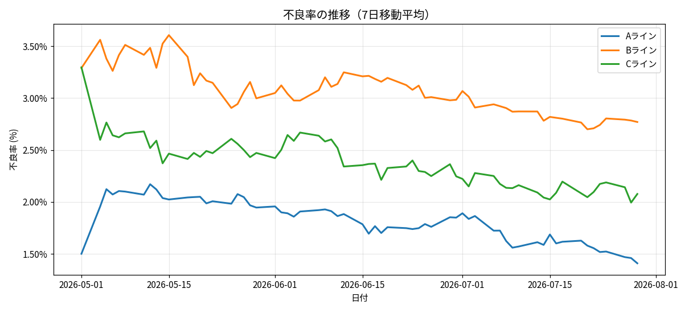
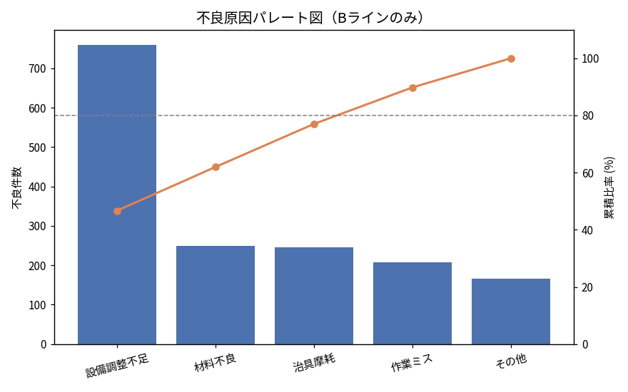

# 製造ライン KPI可視化・分析

製造業での生産管理・品質管理の実務経験をもとに、日々の生産実績データから
**不良率・稼働率・OEE（設備総合効率）** などのKPIを算出し、可視化する分析プロジェクトです。

Python未経験・データ分析未経験からのキャリアチェンジに向けて、`pandas` によるデータ加工と
`matplotlib` による可視化を練習することを目的として作成しました。

## 使用技術

- Python 3
- pandas（データ加工・集計）
- matplotlib（可視化）
- Jupyter Notebook

## データについて

使用しているデータは実データではなく、`data/generate_data.py` で生成した疑似データです。
実務での傾向感（ラインごとの不良率の違い・設備トラブルの発生パターンなど）を反映しつつ、
乱数シードを固定して再現可能な形にしています。

## 分析内容

1. KPI算出（不良率・良品率・稼働率・性能稼働率・OEE）
2. ライン別・日別の不良率トレンド可視化
3. ライン別KPI比較
4. 不良原因のパレート分析（全体／ライン別）
5. 週次OEEヒートマップ

## 主な分析結果（サマリー）

- 3ラインとも期間中に不良率が緩やかに改善する傾向が見られた。
- **Bラインは他ラインよりOEE・稼働率が低く、不良原因も「設備調整不足」に偏っている**ことが
  パレート分析から判明。設備の予防保全計画を見直すことで、不良率と稼働率の両方の改善に
  つながる可能性が高いという仮説を提示。

詳細は [`notebooks/kpi_analysis.ipynb`](notebooks/kpi_analysis.ipynb) を参照してください。

## サンプル可視化

### 不良率の推移（7日移動平均）


### 不良原因パレート図（Bラインのみ）


## セットアップ

```bash
pip install pandas numpy matplotlib jupyter
python data/generate_data.py
jupyter notebook notebooks/kpi_analysis.ipynb
```

## 今後やりたいこと

- 実データ（またはより現実に近いデータ）での再検証
- FastAPIでこの分析をAPI化し、日次データをアップロードすると自動でKPIレポートが
  生成される仕組みを作る
- 異常検知（急な不良率上昇の自動アラート）の実装

## 学びメモ（lessons learned）

- `pandas` の `groupby` + `pivot_table` を使い、集計軸を変えながら複数の切り口で
  同じデータを見る練習になった。
- パレート図（棒グラフ＋累積折れ線の二軸グラフ）を `matplotlib` の `twinx()` で
  描く方法を習得した。
- 日本語フォントがグラフでうまく表示されない問題（いわゆる文字化け）に遭遇し、
  `Noto Sans CJK JP` フォントを指定することで解決した。
- 前職（生産管理・品質管理）で日常的に見ていた指標（不良率・稼働率・OEE）を
  自分でゼロからコードで再現したことで、指標の定義や計算式への理解がより深まった。
